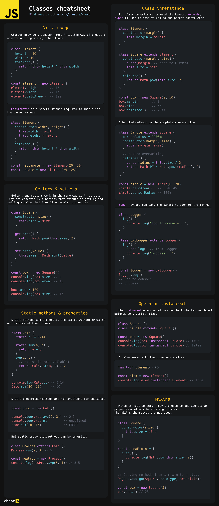

# CheatJS

**We make high quality cheatsheets for JavaScript environment** :sunglasses:

JavaScript is an amazing and unique language. From a simple scripting add-on for web pages, it has grown to an entire infrastructure of immense size, consisting of millions of libraries, hundreds of frameworks and platforms. Our goal is to make learning JavaScript and its environment as simple, enjoyable and fast as possible.

## :page_facing_up: Table of content

> For a better view, [open this README file](https://github.com/cheatjs/cheat/blob/master/README.md) to full screen and zoom in slightly on your browser.

-   [JavaScript](#javascript)
    -   [Array methods](#array-methods)
    -   [String methods](#string-methods)
    -   [Objects](#objects)
    -   [Classes](#classes)
-   [Node.js](#nodejs)
    -   [Node.js basics](#nodejs-basics)
-   [TypeScript](#typescript)
    -   [TypeScript basics](#typescript-basics)

## JavaScript

### Array methods

### String methods

### Objects

### Classes

## Node.js

### Node.js basics

## TypeScript

### TypeScript basics

## :dart: Stay tuned

СheatJS is just beginning its existence. There are plans to create a huge number of cheatsheets on advanced JavaScript, Node.js and TypeScript topics. Naturally, this will also include popular frameworks and libraries.

Anyone can contribute to the development of CheatJS. This repository is completely open to your suggestions and I would be happy to consider any pull request.

We will be very happy if you tell your friends and acquaintances about us! :heart:

<a href="https://github.com/cheatjs/cheat/blob/master/LICENSE">LICENSE</a> 2022.

