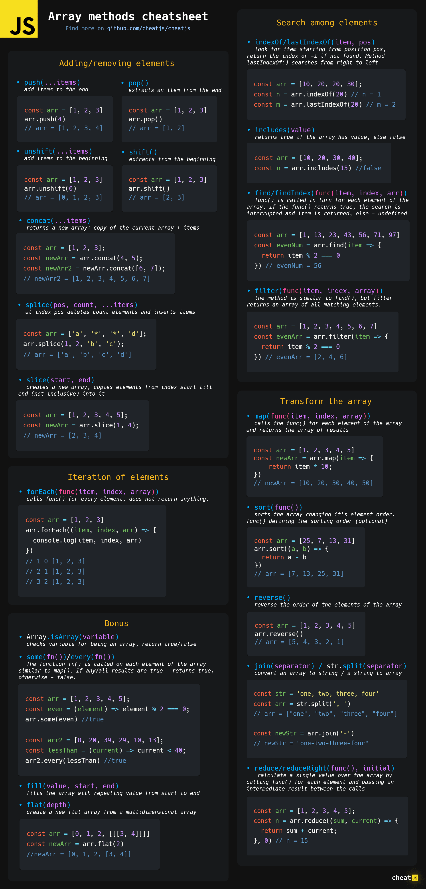
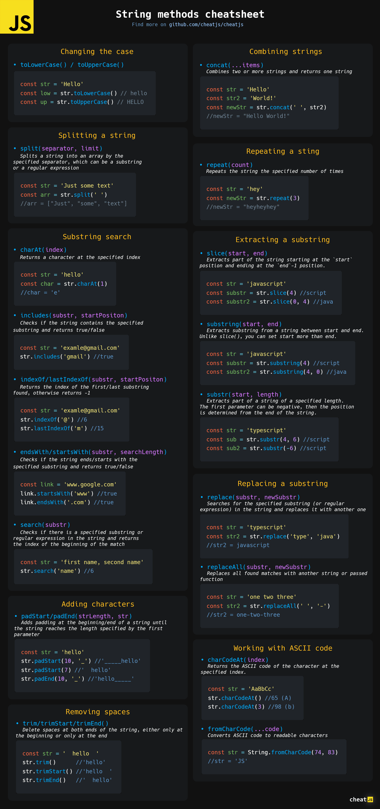
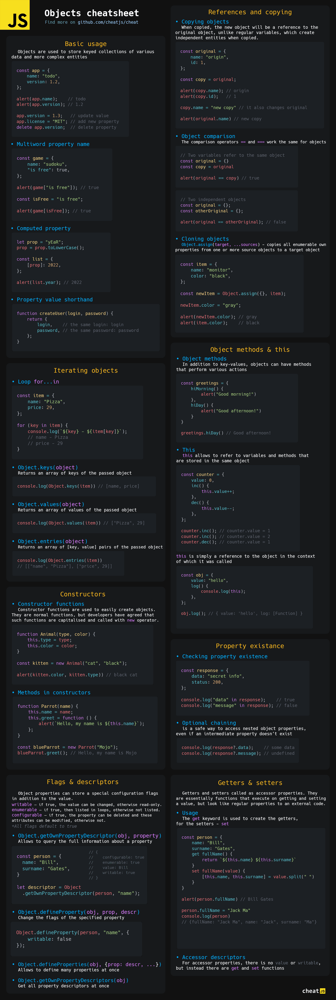
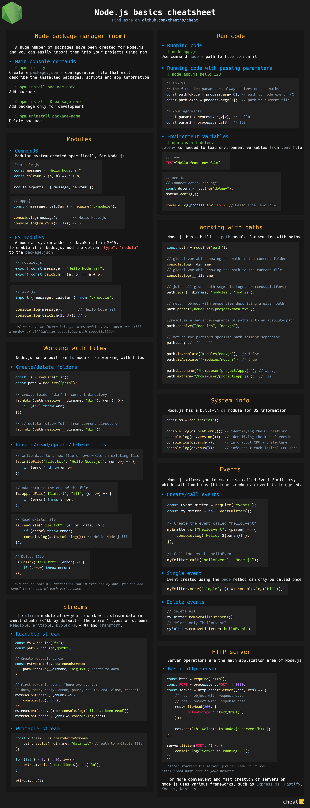
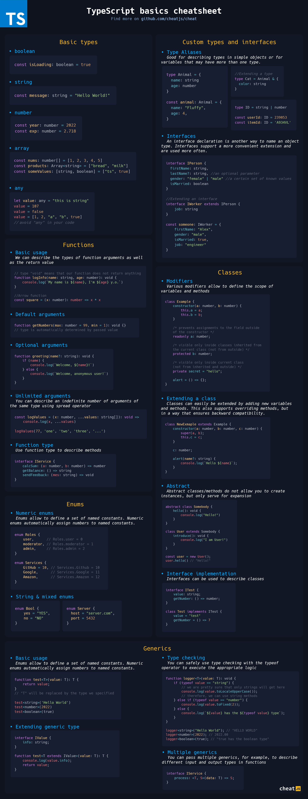

# CheatJS

High quality cheatsheets for JavaScript environment

> For a better view, [open this README file](https://github.com/cheatjs/cheat/blob/master/README.md) to full screen and zoom in slightly on your browser.

## Table of content

-   [JavaScript](#javascript)
    -   [Array methods](#array-methods)
    -   [String methods](#string-methods)
    -   [Objects](#objects)
-   [Node.js](#nodejs)
    -   [Node.js basics](#nodejs-basics)
-   [TypeScript](#typescript)
    -   [TypeScript basics](#typescript-basics)

## JavaScript

### Array methods

### String methods

### Objects

## Node.js

### Node.js basics

## TypeScript

### TypeScript basics

